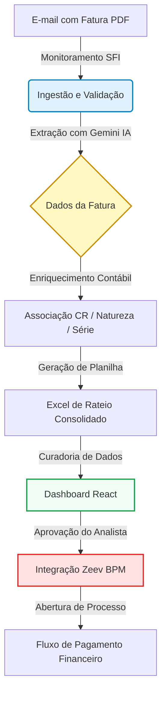

# Apresentação do Projeto: Stoque Fiscal Intelligence (SFI)

O **Stoque Fiscal Intelligence (SFI)** é um ecossistema projetado para automatizar o recebimento, a extração, o rateio e a integração de faturas e notas fiscais de serviços de telecomunicações e infraestrutura de TI da Stoque. O sistema elimina a necessidade de digitação manual de faturas e planilhas, reduzindo erros operacionais e garantindo o compliance regulatório antes do envio para pagamento.

---

## 1. Visão Geral do Fluxo

O diagrama abaixo ilustra o fluxo de dados ponta a ponta do projeto, desde a captura do documento fiscal até a abertura do processo de pagamento:

---

## 2. O que o Projeto Contempla (Escopo)

A solução atende aos seguintes requisitos e funcionalidades técnicas:

| Módulo | Funcionalidades Contempladas |
| :--- | :--- |
| **Ingestão Automática** | <ul><li>Monitoramento ativo de caixas de entrada de e-mail (via Microsoft Graph / IMAP).</li><li>Download de anexos em PDF correspondentes a faturas.</li><li>Upload manual de faturas via painel.</li></ul> |
| **Extração Inteligente (IA)** | <ul><li>Processamento de faturas estruturadas e não estruturadas em PDF usando o Gemini IA.</li><li>Captura inteligente de CNPJ, Razão Social, Número do Documento, Data de Emissão, Vencimento e Valor Total.</li></ul> |
| **Regras e Rateios** | <ul><li>Higienização e enriquecimento contábil das faturas.</li><li>Mapeamento dinâmico de Centro de Resultado (CR), Natureza de Despesa e Número de Série de Equipamentos.</li><li>Geração e atualização automatizada de planilhas Excel de rateio com fórmulas financeiras de soma.</li></ul> |
| **Painel de Controle** | <ul><li>Interface web responsiva (React + Vite) para monitorar o status dos arquivos.</li><li>Visualização integrada do PDF original ao lado dos dados extraídos.</li><li>Edição manual rápida de campos fiscais e vencimentos diretamente no painel.</li><li>Controle de prazos e alertas visuais de criticidade de vencimentos.</li></ul> |
| **Alertas e Notificações** | <ul><li>Envio de alertas de vencimento diários por e-mail (via SMTP) para o time financeiro/gestor.</li></ul> |
| **Integração Zeev** | <ul><li>Simulação de payload e validação de regras de negócios na API do Zeev (Orquestra BPM).</li><li>Abertura automática de solicitações de pagamento anexando a Fatura PDF, o Boleto e o Excel de Rateio.</li></ul> |

> [!NOTE]
> O sistema adota o modelo **AI-First com Curadoria Humana**: os dados extraídos pelo Gemini são apresentados no Dashboard para aprovação explícita do analista fiscal antes do envio ao Zeev, garantindo 100% de precisão nos lançamentos.

---

## 3. O que o Projeto NÃO Contempla (Fora de Escopo)

Para manter a integridade operacional e focar na eficiência do fluxo de curadoria, as seguintes ações e módulos não fazem parte do escopo do projeto:

* **Pagamento Financeiro Direto**: O SFI não se conecta a bancos, gateways de pagamento ou ERPs (como SAP ou Totvs) para realizar liquidação financeira ou transferências. A liquidação ocorre dentro do próprio fluxo do Zeev.
* **Módulo de Compras (Procurement)**: O sistema não gerencia fluxo de ordens de compra, contratos de fornecedores ou cotações de preços.
* **Processamento de Outros Documentos**: Documentos não fiscais (ex: minutas de contrato, relatórios de reembolso de despesas de viagem, holerites) não são processados pela esteira de extração de faturas.
* **Cadastro de Usuários no Zeev**: Permissões de acesso de usuários, criação de grupos, associação de times e cargos devem ser administrados diretamente no portal web do Zeev.
* **Banco de Dados Relacional Pesado**: Os dados de Notas Fiscais e histórico de consumo de IA são gravados e persistidos em arquivos estruturados JSON e CSV locais no servidor para manter a aplicação leve e independente.

---

## 4. Arquitetura Tecnológica

A solução foi estruturada sob uma arquitetura de monorepo e microsserviços leves:

* **Backend (Automação)**: Desenvolvido em Node.js (TypeScript) responsável pela leitura de e-mails, processamento do Gemini, geração de planilhas Excel e serviços de API local (Express).
* **Frontend (Dashboard)**: Aplicação web desenvolvida em React, TypeScript e Vite, utilizando Tailwind CSS e Lucide Icons para interface rica e responsiva.
* **Segurança e Privacidade**: Nenhuma credencial ou token de acesso é chumbado no código-fonte. Todas as chaves e segredos da API do Gemini, do Microsoft Graph e do Zeev são injetados exclusivamente através do arquivo de configuração do ambiente (`.env`), que é ignorado pelo Git.

---

> [!IMPORTANT]
> **Políticas de Compliance Zeev (Fluxo 2044):**
> O robô garante o preenchimento de campos fixos de segurança obrigatórios para o faturamento (ex: confirmar o download do modelo correto de rateio Excel, indicar que a fatura possui rateio como "Sim", configurar "Helder Venancio Marques" como Diretor/Head e "Stoque BH" como local de prestação do serviço).
