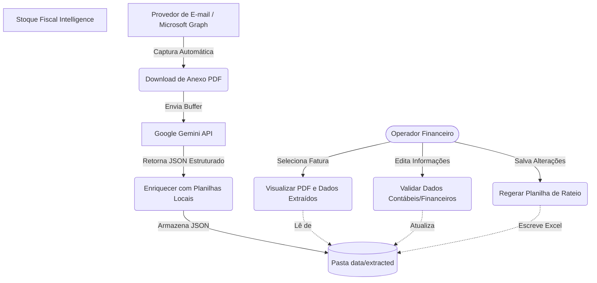

# Especificações do Projeto

A definição do escopo e os limites do sistema foram orientados a partir das necessidades cotidianas do time de contas a pagar e operações fiscais do cliente.

## Personas

1. **Mariana Silva (34 anos) - Analista Fiscal Sênior**: Lida diariamente com mais de 50 notas complexas de locação de hardware e serviços de TI. Sente-se frustrada por gastar a maior parte do dia abrindo planilhas de inventário para identificar a qual Centro de Resultado (CR) cada número de série de notebook faturado deve ser debitado. Busca uma ferramenta que automatize esse cruzamento e exiba tudo em uma única tela.
2. **Carlos Alberto (28 anos) - Assistente Financeiro**: Responsável por digitar os dados de pagamento (linha digitável, vencimento, valores de impostos retidos) das despesas de filiais no portal Zeev. Sofre com cansaço visual e erros frequentes de digitação de boletos bancários. Espera um sistema que preencha a linha digitável e os valores de forma automática e confiável.

## Histórias de Usuários

| EU COMO... | QUERO/PRECISO... | PARA... |
| :--- | :--- | :--- |
| Analista Fiscal | Que o PDF da fatura seja lido e interpretado automaticamente por IA | Evitar a digitação manual de campos cadastrais e financeiros. |
| Analista Fiscal | Visualizar o PDF do documento ao lado dos campos extraídos na tela | Validar rapidamente os dados sem precisar abrir visualizadores de PDF externos. |
| Assistente Financeiro | Que o sistema consulte as planilhas de inventário de hardware pelo número de série de cada item | Realizar o preenchimento automático das informações contábeis de rateio de forma individualizada. |
| Assistente Financeiro | Ter um card de rateio editável no topo do formulário do documento | Atualizar de forma síncrona a classificação contábil global de documentos simples. |
| Analista Fiscal | Que o Excel final de rateio (`Rateio.xlsx`) seja regerado automaticamente após salvar edições | Garantir que a exportação financeira para o ERP reflita perfeitamente as correções humanas de curadoria. |
| Gerente Financeiro | Visualizar relatórios do consumo de tokens e custos médios do processamento de IA | Monitorar a saúde orçamentária do ecossistema e seu ROI. |

## Requisitos

### Requisitos Funcionais

| ID | Descrição do Requisito | Prioridade |
| :--- | :--- | :--- |
| **RF-001** | Capturar faturas em PDF de forma assíncrona via e-mail e disponibilizar para processamento. | ALTA |
| **RF-002** | Extrair dados fiscais e financeiros de faturas em PDF usando o modelo Google Gemini API. | ALTA |
| **RF-003** | Enriquecer dados contábeis (CR, Natureza, Contrato) via tabela local de referência baseada em CNPJ (`data/base_referencia.csv`). | ALTA |
| **RF-004** | Enriquecer faturas de locação por número de série de hardware cruzando com tabelas locais de notebooks/monitores (`.xlsx` e `.xlsb`). | ALTA |
| **RF-005** | Disponibilizar uma interface web (Dashboard) para listagem e seleção de documentos processados. | ALTA |
| **RF-006** | Exibir o documento PDF correspondente integrado diretamente na interface do Dashboard. | ALTA |
| **RF-007** | Permitir a ordenação da lista de faturas na Sidebar por Nome, Valor e Data de Vencimento. | MÉDIA |
| **RF-008** | Implementar paginação e contador de documentos na barra lateral do Dashboard para performance de renderização. | MÉDIA |
| **RF-009** | Disponibilizar formulário interativo de edição dos campos contábeis, financeiros e fiscais extraídos. | ALTA |
| **RF-010** | Fornecer uma seção de classificação rápida de rateio no topo do formulário do dashboard (com propagação de dados em rateios unitários). | MÉDIA |
| **RF-011** | Regerar a planilha Excel de rateio financeiro (`Rateio.xlsx`) de forma automática no servidor Express após a validação e salvamento do operador. | ALTA |
| **RF-012** | Gerar relatórios agregados via terminal sobre o consumo cumulativo e latências das chamadas da IA (`yarn usage`). | BAIXA |

### Requisitos Não Funcionais

| ID | Descrição do Requisito | Prioridade |
| :--- | :--- | :--- |
| **RNF-001** | O backend deve ser desenvolvido em Node.js utilizando TypeScript para melhor tipagem e manutenibilidade. | ALTA |
| **RNF-002** | O frontend (Dashboard) deve ser construído como uma Single Page Application (SPA) em React 19 e TypeScript. | ALTA |
| **RNF-003** | A persistência dos dados e do histórico deve utilizar estrutura de arquivos JSON por nota, evitando overhead de configuração de bancos externos em fluxos locais simples. | MÉDIA |
| **RNF-004** | O layout do Dashboard deve ser responsivo e aplicar boas práticas de design (como HSL e transições suaves). | MÉDIA |
| **RNF-005** | As operações de salvamento e regeração do Excel devem responder em menos de 1 segundo. | ALTA |
| **RNF-006** | A autenticação com os serviços externos e provedores de IA deve ser configurada estritamente por variáveis de ambiente via arquivo `.env` seguro. | CRÍTICA |

## Restrições

| ID | Restrição |
| :--- | :--- |
| **RE-001** | O processamento e enriquecimento automático dependem da integridade estrutural dos arquivos locais de hardware (`rateio_monitores.xlsx` e `rateio_notebooks.xlsb`). |
| **RE-002** | Toda e qualquer chave de API (`GEMINI_API_KEY`) ou credencial de e-mail deve ser mantida localmente sob exclusão do controle de versão do Git. |
| **RE-003** | O monorepo deve ser executado localmente de forma isolada, não permitindo dependências instaladas fora do escopo do `package.json`. |

## Diagrama de Casos de Uso

# Gerenciamento de Projeto

O gerenciamento e ciclo de vida do projeto seguem o histórico de refinamentos documentados de forma sequencial e atômica. A evolução das tarefas e suas respectivas metas de tempo e escopo são registradas no histórico contínuo do projeto (`plan.md`).
