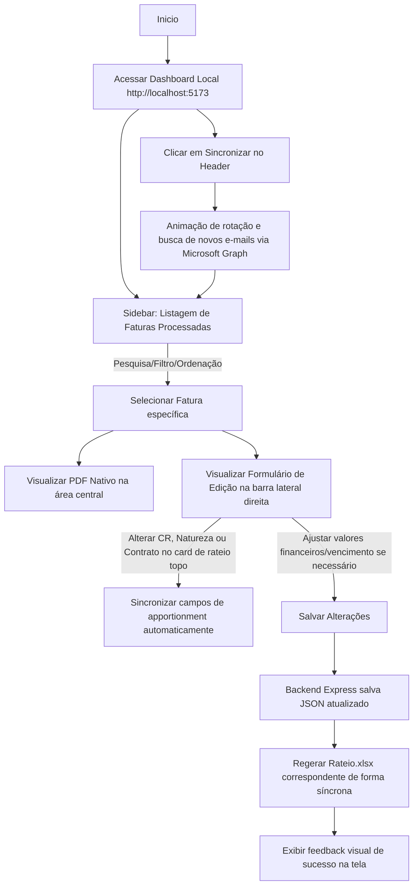

# Projeto de Interface

A interface do **Stoque Fiscal Intelligence (SFI)** foi projetada sob o conceito de curadoria visual assistida por inteligência artificial ("human-in-the-loop"). O objetivo é garantir que o operador financeiro consiga validar, editar e aprovar os dados extraídos pela IA de forma rápida, confrontando visualmente o documento original com o formulário em tempo real.

## Diagrama de Fluxo

O fluxo de interação do usuário com a plataforma segue as etapas mapeadas a seguir:



## Wireframes

O layout do Dashboard foi desenvolvido com foco em eficiência e clareza visual, distribuindo a tela em três áreas principais:

```text
+-----------------------------------------------------------------------------------+
|  [SFI Logo] Stoque Fiscal Intelligence                       [ Sincronizar (Loop) ]|
+-----------------------------------------------------------------------------------+
| Buscar... (🔍)      |                                 | Apportionment (Rateio)    |
| Ordenar: [Vencimento]|                                 | CR: [ 102003 ]            |
|                     |                                 | Natureza: [ 3.1.90.11 ]   |
| +-----------------+ |                                 | Contrato: [ CT-982/2026 ] |
| | Fatura - TI-19  | |                                 |---------------------------|
| | Vence: 28/06/26 | |        PDF VIEWER INTERNO       | Fornecedor: [ Stoque S.A ]|
| | R$ 12.450,00    | |                                 | CNPJ: [ 12.345.678/0001 ] |
| +-----------------+ |     Exibe a nota original       | Vencimento: [ 2026-06-28 ]|
| | Fatura - TI-18  | |     em formato PDF nativo       | Valor Líq:  [ 12450.00 ]  |
| | Vence: 20/06/26 | |                                 |---------------------------|
| | R$ 4.200,00     | |                                 | ISS:   [ 120.00 ]         |
| +-----------------+ |                                 | IRRF:  [ 0.00 ]           |
|                     |                                 |                           |
| [1] 2 3 4 [Próx]    |                                 | [ Salvar Dados ]          |
+-----------------------------------------------------------------------------------+
```

- **Sidebar (Esquerda)**: Permite controle do volume de trabalho via filtros, buscas por termos e ordenação rápida por prioridade de vencimento ou valores altos. Inclui paginação dinâmica para evitar lentidão do navegador.
- **DocumentViewer (Centro)**: Utiliza a capacidade do navegador para exibir o PDF original com ferramentas de zoom e rolagem nativa, garantindo precisão visual sem necessidade de download do arquivo.
- **DataEditor (Direita)**: Formulário inteligente que expõe os campos contábeis no topo para preenchimento ágil. A alteração das classificações é propagada automaticamente ao rateio interno nos casos de documentos unitários, evitando tarefas repetitivas.
