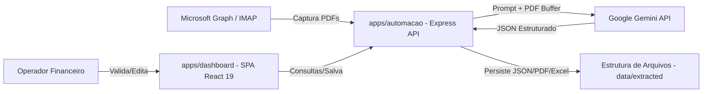

# Arquitetura da Solução

O **Stoque Fiscal Intelligence** foi desenvolvido sob o modelo de monorepo utilizando **npm workspaces**. Isso permite o isolamento de dependências entre o frontend e o backend, enquanto mantém estruturas e interfaces de tipagem compartilhadas de forma simplificada.



## Estrutura e Contrato de Dados (Persistência Local)

Ao invés de um banco de dados NoSQL/SQL tradicional, o projeto utiliza persistência estruturada em arquivos no sistema local (`data/extracted/<nome_da_nota>/`). Cada nota fiscal ou boleto processado possui seu subdiretório contendo:
1. O arquivo original em formato `.pdf`.
2. O arquivo JSON estruturado `.json` com os dados extraídos e editados.
3. O arquivo `.txt` de log visual simplificado.
4. A planilha de rateio correspondente `.xlsx`.

O contrato de dados central que governa as faturas é a interface `BoletoData` (`apps/automacao/src/features/pdf/types.ts`):

```typescript
export interface BoletoData {
  documentType?: string;          // Ex: "Boleto", "Nota Fiscal"
  beneficiary?: {
    name?: string;                // Nome do favorecido
  };
  payer?: {
    name?: string;                // Nome da empresa pagadora
    cnpjCpf?: string;             // CNPJ do pagador
  };
  supplier?: {
    name?: string;                // Fornecedor emissor
    cnpjCpf?: string;             // CNPJ do fornecedor
  };
  financial?: {
    dueDate?: string;             // Vencimento (YYYY-MM-DD)
    originalValue?: number;       // Valor bruto
    chargedValue?: number;        // Valor líquido a pagar
    issueDate?: string;           // Emissão
    competenceDate?: string;      // Competência fiscal
    taxes?: {                     // Impostos retidos
      iss?: number;
      irrf?: number;
      pis?: number;
      cofins?: number;
      csll?: number;
    };
  };
  documentIdentifiers?: {
    ourNumber?: string;           // Nosso número (boleto)
    documentNumber?: string;      // Número da nota fiscal
    clientAccount?: string;
  };
  barcode?: string;               // Código de barras / Linha digitável
  accountingFields?: {            // Enriquecimento Contábil
    cr?: string;                  // Centro de Resultado
    crDescription?: string;
    naturezaCode?: string;        // Natureza da despesa
    naturezaDescription?: string;
    contract?: string;            // Número do contrato associado
  };
  apportionment?: Array<{         // Lista de rateio detalhado (por ativo)
    serialNumber?: string;        // Número de série do hardware
    cr?: string;
    naturezaCode?: string;
    contract?: string;
    value?: number;
  }>;
}
```

### Enriquecimento de Dados
A inteligência de rateio funciona cruzando informações extraídas com bases em memória durante a etapa de orquestração:
- **`data/base_referencia.csv`**: Tabela de de/para que associa o CNPJ do fornecedor aos dados contábeis padrões.
- **`rateio_monitores.xlsx`** e **`rateio_notebooks.xlsb`**: Tabelas de hardware que realizam o de/para dos números de série de notebooks e monitores faturados para seus respectivos centros de custo e contratos individuais.

## Tecnologias Utilizadas

- **Runtime**: Node.js v20+ / TypeScript.
- **Backend Framework**: Express para roteamento de API HTTP.
- **Frontend Framework**: React 19 + TypeScript + Vite.
- **Processamento de PDFs e Tabelas**:
  - `@google/generative-ai`: Integração com modelos Google Gemini (`gemini-1.5-flash` / `gemini-2.0-flash`) para extração contextual inteligente.
  - `exceljs` e `xlsx`: Leitura de inventários de hardware (.xlsb/.xlsx) e geração da planilha agrupada de rateio.
  - `pdf-lib` / `pdf-parse`: Manipulação e leitura básica de buffers de PDF.
- **Estilização**: CSS Vanilla moderno (variáveis HSL, animações com `@keyframes`, transições).
- **Interface e Iconografia**: `lucide-react` para elementos gráficos de controle.

## Hospedagem

O ecossistema é executado localmente ou hospedado na intranet do cliente (servidor de aplicação privado Windows/Linux) de forma simplificada, necessitando apenas da presença de variáveis de ambiente configuradas no arquivo `.env` para autenticação com a API do Google AI Studio e servidores de e-mail do Microsoft Graph.

## Qualidade de Software

Norteadas pela norma **ISO/IEC 25010**, a equipe selecionou as seguintes subcaracterísticas para guiar a qualidade do produto:
1. **Adequação Funcional (Completude)**: A IA e as regras de enriquecimento devem extrair e classificar os campos necessários para faturamento no Zeev de forma completa.
2. **Eficiência de Desempenho (Tempo de Resposta)**: Salvamento e recálculos no painel de curadoria devem ocorrer em menos de 1 segundo de forma síncrona.
3. **Usabilidade (Estética da Interface / Proteção contra Erros)**: Posicionamento dos campos de rateio no topo, formatação automatizada de números e moedas brasileiras e paginação na Sidebar para evitar estouros de memória no navegador.
4. **Segurança (Confidencialidade)**: Isolamento das chaves privadas e credenciais do Microsoft Graph utilizando variáveis de ambiente injetadas no runtime, nunca expostas no código de repositório.
